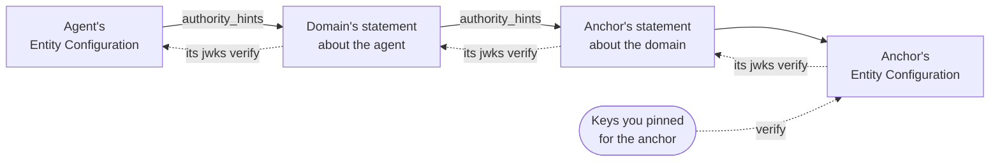
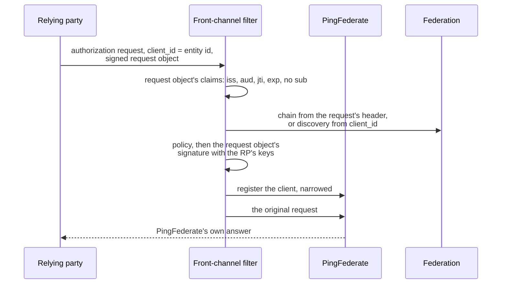
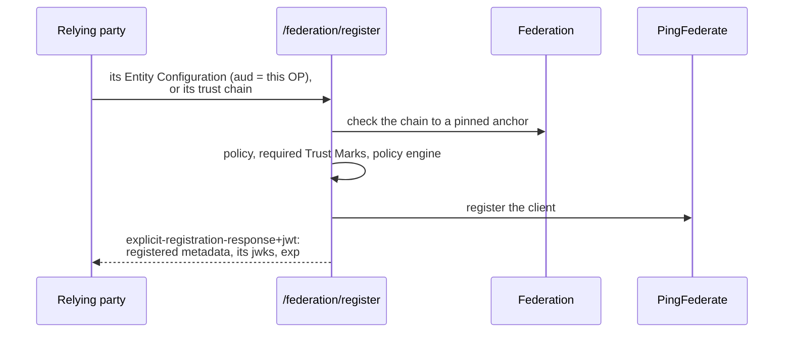

# How it works

This page takes the federation support apart: how a chain is checked, where trust starts, how policy and
constraints narrow what an entity can do, what Trust Marks add, how clients register and for how long, where a
policy engine fits, and what stops when. It assumes the [overview](overview.md). Section numbers like §10.2
are [OpenID Federation 1.0](https://openid.net/specs/openid-federation-1_0.html)'s.

## A chain, step by step

A *trust chain* is a list of signed statements from an entity up to a trust anchor: the entity's own Entity
Configuration, a Subordinate Statement about it from each organisation above it, and the anchor's Entity
Configuration at the top. PingFederate either receives a chain (a client can send one) or builds one by
discovery - fetching the entity's configuration from `https://<entity>/.well-known/openid-federation`, reading
its `authority_hints`, fetching each superior's configuration and asking its fetch endpoint for the statement
about the entity, until it reaches an anchor it trusts.



A chain counts only when all of these hold (§3.2, §10.2):

1. **Every statement is what it says it is.** A JWT typed `entity-statement+jwt`, signed with an asymmetric
   algorithm (never `none`, never a shared secret), with a `kid` naming exactly one key.
2. **Every statement is current.** Issued in the past and not yet expired, allowing a minute of clock skew.
3. **The entity signed its own configuration** with a key it publishes in it.
4. **Each statement is signed by the key its superior vouched for.** The statement a superior makes about an
   entity lists the entity's keys; the entity's own statement has to verify with one of them, all the way up.
5. **The top is signed by a key you pinned.** Never by keys fetched from the anchor's own URL - anyone who
   controls that URL could otherwise put any keys there.
6. **The constraints hold.** A superior can limit how deep the tree below it goes, which domain names its
   subordinates may use, and which kinds of entity they may be.
7. **The policy composes.** Every superior's metadata policy combines without contradiction, and the result
   applies to the entity's metadata.
8. **Nothing critical is unknown.** A statement that marks a claim as critical (`crit`) this implementation
   doesn't understand is refused, as the specification requires.

The chain lasts as long as its shortest-lived statement (§10.4). That number bounds everything built on the
chain, registrations included.

Discovery is where a stranger could make PingFederate do work, so it is bounded: at most 24 fetches per chain,
at most 10 `authority_hints` read per entity, and every URL screened by the outbound URL policy (https only, no
private addresses unless allowed). A chain a client presents is checked as it stands, with no fetches at all,
so a forged chain can't aim PingFederate's fetches anywhere; if it doesn't hold together on its own,
PingFederate discovers the client's chain from the client's own Entity Configuration instead.

## Keys you pin, not keys you fetch

Trust starts with the anchor's public keys, captured once, out of band (§10(1)), and set in
`OIDF_FEDERATION_TRUST_ANCHOR_JWKS`. That can be one key set or several anchors at once, as a map of anchor to
key set. A chain may end at any of them, and a caller asking PingFederate to resolve can name which.

PingFederate can also be an anchor itself (`OIDF_FEDERATION_SELF_ANCHOR`). Then chains that end at it are
checked with the key it signs with, read from its own key store each time, so its key can rotate without
anyone re-pinning. Pinning its own keys as well is refused: that copy would go stale at the first rotation.

When an anchor rolls its key (§11.2), add the new key to the pinned set before the anchor starts signing with
it, and remove the old one after. [Operations](operations.md#rolling-an-anchor-key) has the steps.

## Metadata, and the policy that narrows it

An entity describes itself in its `metadata`, one block per role: `openid_relying_party`, `oauth_client`,
`openid_provider` and so on. A superior can override parts of it, and can publish a `metadata_policy` that says
what its subordinates may claim. The policies from every superior in the chain combine, and the result is
applied to the entity's own metadata. What comes out is what PingFederate registers.

A policy is a set of operators per parameter. Each does one thing (§6.1.3.1):

| Operator | What it does |
|---|---|
| `value` | Sets the parameter to this, whatever the entity said - `null` removes it |
| `add` | Adds these values to the entity's own |
| `default` | Uses this when the entity said nothing |
| `one_of` | The entity's value must be one of these |
| `subset_of` | Keeps only the entity's values that are also in this list - possibly none |
| `superset_of` | The entity's values must include all of these |
| `essential` | The parameter must be there |

For example, a domain that lets its agents ask for at most `read` and `write`, and always the `audit` scope:

```json
"metadata_policy": {
  "oauth_client": {
    "scope": { "subset_of": ["read", "write", "audit"], "superset_of": ["audit"] }
  }
}
```

An agent that claims `scope: "read write admin audit"` is registered with `read write audit`. One that leaves out
`audit` isn't registered at all. Where two superiors' policies contradict each other - one says `value: A`,
another `value: B` - the chain fails; nothing is guessed.

`OIDF_REQUIRE_METADATA_POLICY` (on by default) goes further than the specification: a chain whose superiors set
no metadata policy for the role being registered constrains nothing, so registration refuses it rather than
let the entity grant itself whatever it asks for.

## Constraints

A superior can also put `constraints` on the statement it makes about a subordinate (§6.2), and they hold for
everything below it:

- `max_path_length` - how many intermediates may sit between it and a leaf;
- `naming_constraints` - which host names entities below it may have, as permitted and excluded subtrees
  (`.example.com` means any host under `example.com`); an excluded name loses even if it's also permitted, and
  an empty permitted list permits nothing;
- `allowed_entity_types` - which roles entities below it may play. A role it doesn't list is removed from the
  entity's metadata before policy applies.

PingFederate enforces them when it checks a chain, and puts its own on the statements it issues when
`OIDF_FEDERATION_SUBORDINATE_CONSTRAINTS` is set.

## Trust Marks

A Trust Mark is a signed badge: an issuer says an entity has passed something (§7). It is only worth what the
issuer is worth, so a mark counts only when:

- the trust anchor the entity's chain reached says who may issue marks of that type (`trust_mark_issuers`),
  and names this issuer;
- the issuer's own chain reaches the same anchor, and the mark verifies with the issuer's key;
- it is about this entity and hasn't expired;
- where the anchor names an owner for the type (`trust_mark_owners`), the mark carries a delegation from that
  owner, and the delegation verifies too;
- with `OIDF_FEDERATION_TRUST_MARK_STATUS_CHECK` on, the issuer's status endpoint says it is still active.

A mark that fails any of these is ignored; it never breaks the chain. `OIDF_FEDERATION_REQUIRED_TRUST_MARKS`
says which marks an entity needs before PingFederate registers it, per role.

PingFederate can issue marks too. The types it issues are configuration; who holds one is a grant an operator
makes through the admin API. It answers the Trust Mark endpoint (the mark itself), the status endpoint (is
this mark still active?) and the listing (who holds one), and puts the marks it issued an agent it hosts into
that agent's configuration.

## Registering a client

A client from the federation - a relying party, or an agent - becomes a PingFederate client in one of two
ways. In both, PingFederate checks the chain first, applies the policy, asks the policy engine when one is
configured, and only then writes the client. What it writes is what came out of the policy, never more than
the client asked for: its scopes, grant types, response types and redirect URIs, and the keys it proved it
holds.

**Automatically, on the client's first request** (§12.1). The client doesn't register first; it just asks.

- *At the token endpoint* - how agents do it. The agent authenticates with a `client_assertion` whose header
  can carry its trust chain. A filter in front of PingFederate's token endpoint checks the chain, registers the
  agent, and lets the same request through for PingFederate to authenticate it as normal.
- *At the authorization and PAR endpoints* - how relying parties do it. The request carries a signed request
  object, or at PAR a client assertion, and that signature is what proves the relying party holds its keys.



A relying party already registered this way proves itself again on every request: each request object has to
meet the same rules, be signed with a key it registered, and carry a `jti` it hasn't used before (§12.1.1).

When the chain doesn't check out at the authorization endpoint, the answer is an error page, never a redirect:
§12.1.3 says the redirect URI of a client you can't trust is not one to send anyone to. At PAR it is a JSON
error.

**Explicitly, before any request** (§12.2). The client POSTs its Entity Configuration, or its whole chain, to
`/federation/register`. PingFederate checks it, registers the client and answers with a signed registration
response: what was registered, the client's own keys, and when the registration ends.



## How long a registration lasts

Every registration ends (§12.3). It lasts until the chain expires or `OIDF_REGISTRATION_MAX_TTL_SECONDS`
(a day) runs out, whichever is sooner - or sooner still if the policy engine says so. A chain that would give
it less than `OIDF_REGISTRATION_MIN_TTL_SECONDS` (a minute) registers nothing.

An automatic registration renews itself. The client's next request in the registration's last five minutes, or
after it has expired, has PingFederate check the chain again and extend the registration. A client whose chain
no longer checks out gets no extension, and once its registration has expired it is refused. An explicit
registration is never renewed by PingFederate; the client registers again before its `exp`, as §12.3 says.

A background sweeper disables expired federation clients every five minutes. It never deletes one, and a
renewal enables it again - but a client an operator disabled stays disabled.

## Asking a policy engine

A federation can say what an entity may be. It can't say what your organisation wants to let in today. For
that, PingFederate can ask a policy decision point over [AuthZEN 1.0](https://openid.net/specs/authorization-api-1_0.html)
- PingAuthorize, or anything that speaks it - at each decision it is told to: explicit and automatic
registration (by default), enrolling a hosted agent, and issuing a token.

The question names the entity, what it wants and where (for example `federation.register.automatic` at the
authorization endpoint), and the context: its roles, its anchor, the Trust Marks that verified, the scopes and
grant types it asked for. The answer is yes or no, and a yes can narrow what is granted: fewer scopes, fewer
grant types, a shorter registration, a Trust Mark it must hold. It can never widen anything. If no answer comes
back - the PDP is down, slow, or says something that isn't a decision - the request is refused with a 503,
unless you have chosen to fail open.

## Client authentication at the federation endpoints

By default anyone may call PingFederate's federation endpoints (§8.8). A federation can decide otherwise, per
endpoint: `optional` or `required`. A client that authenticates POSTs a `private_key_jwt` assertion signed with
one of its Federation Entity Keys; PingFederate resolves the client's chain to find those keys, so only a member
of the federation can authenticate. An endpoint that requires it refuses everyone else, and the entity
configuration says which endpoints take it.

## What stops when

Federation replaces "delete the client" with "stop vouching for it". That works, but not instantly, and it's
worth knowing where the gaps are.

| You do this | This stops | This carries on |
|---|---|---|
| Suspend or revoke an agent PingFederate hosts | Its Entity Configuration and the statement about it stop being served at once, so every new chain through it fails | Registrations other OPs already made last until they expire - at most their chain's life - and tokens already issued until theirs do |
| An anchor or intermediate stops vouching for an entity | New chains to it fail | Existing registrations until they're due for renewal; then the renewal fails |
| Disable the client in PingFederate | Its tokens, at once | Nothing - an operator's disable is never undone by a renewal |
| Revoke a Trust Mark grant | The status endpoint answers `revoked`; new registrations that require the mark fail | Copies of the mark already handed out verify until they expire, for anyone who doesn't check status |

Keep chains short-lived where it matters: a statement that lasts an hour means a registration lasts at most an
hour.

## Where to next

[Configuration](configuration.md) lists every setting. [Operations](operations.md) covers pinning anchors,
running hosted agents, reading the logs and wiring a PDP. [Limits](limits.md) says what isn't done.
