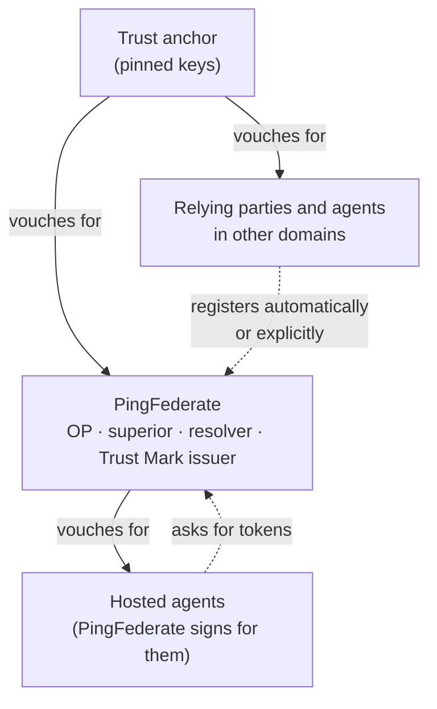

# OpenID Federation in PingFederate

This page says what OpenID Federation is, why this repo uses it for AI agents, and the parts PingFederate
plays in a federation. [How it works](how-it-works.md) takes each part apart; [configuration](configuration.md)
and [operations](operations.md) are for running it.

## Trust without a phone call

Two organisations that want their systems to trust each other usually swap details by hand: a client id, a
secret or a key, a redirect URI, typed into each other's admin consoles. That works for ten partners. It
doesn't work for ten thousand agents that exist for an afternoon.

[OpenID Federation 1.0](https://openid.net/specs/openid-federation-1_0.html) replaces the phone call with
signed statements. Every server - an *entity* - publishes a signed description of itself at a well-known
address. The organisation above it publishes a signed statement about it too, saying which keys it uses and
what it may do. Follow those statements up the tree to an organisation you already trust, a *trust anchor*,
and you know who you are dealing with. The anchor's public keys are the only thing anyone configures by hand.

## Why agents

An AI agent is a client like any other, but there are a lot of them and they don't last. Registering each one
in PingFederate by hand is not going to happen, and a shared client for all of them means nobody can tell
them apart or turn one off.

With federation, the agent's own organisation vouches for it, and PingFederate registers it the first time it
asks for a token: its keys and metadata come from the chain of statements, cut down by whatever the
federation's policy allows, and the registration lasts no longer than the chain does. When the organisation
stops vouching, the next renewal fails and the agent stops getting tokens. Nobody at the PingFederate end has
to do anything.

## The parts PingFederate plays

A federation entity can play several roles at once. This repo lets PingFederate play all of these.

**An OpenID Provider that registers clients from the federation.** PingFederate publishes its own Entity
Configuration at `/.well-known/openid-federation`, describing itself as an OP with the same metadata its own
discovery document serves. A relying party or an agent from another domain can register without an
administrator: automatically, on its first request at the token, authorization or PAR endpoint, or explicitly
at `/federation/register`. Either way PingFederate checks the client's chain to an anchor it trusts first.

**A trust anchor, or an intermediate.** PingFederate can sit at the top of a federation, or partway down. It
issues Subordinate Statements about the entities below it, answers the fetch and list endpoints, and can
carry constraints on what those entities may be. It can be its own trust anchor without pinning its own keys.

**A domain authority for agents.** An agent that lives for an afternoon shouldn't have to run a web server
to publish its own Entity Configuration. PingFederate hosts it instead: it signs the agent's configuration
with a key it keeps in OpenBao, serves it, and lets an operator suspend, revoke or re-key it through an admin
API. Suspending an agent stops it resolving on the next request.

**A Trust Mark issuer.** A Trust Mark is a signed badge - "certified", "passed our checks" - that a federation
can require before it trusts an entity. PingFederate can issue them to entities it has been told to, answer
whether a mark is still active, and list who holds one. It also checks marks other issuers gave, and can
refuse to register an entity without the marks it needs.

**A resolver.** Anyone can ask PingFederate to resolve an entity: to build and check its chain to a named
anchor and hand back the result, signed. By default it resolves only the entities it knows - itself, its
subordinates and the agents it hosts - so a stranger can't use it to crawl the internet.

**A consumer of other chains.** Beyond registration, PingFederate uses the same chain checks to decide
whether to trust a client attestation's issuer, and a wallet provider.

Around all of it: a policy engine can have the final say on who registers and what they get (it can refuse or
narrow, never widen), every decision is logged the way PingFederate logs its own, and each federation
endpoint can require the caller to authenticate.

## Where it lives

| What | Where |
|---|---|
| The federation itself: chains, policy, constraints, Trust Marks, statements, hosted entities. No PingFederate code. | [`libs/openid-federation`](../../libs/openid-federation/README.md) |
| PingFederate's side: the servlets, the registration filters, the OGNL hooks, configuration, logging | [`servlets/pf-integration`](../../servlets/pf-integration/README.md) |
| A PingFederate you can run from this repo, and the conformance suite's plans against it | [`conformance/`](../../conformance/README.md) |

Next: [how it works](how-it-works.md). Words you don't know are in the [glossary](glossary.md); what it
doesn't do is in [limits](limits.md).
